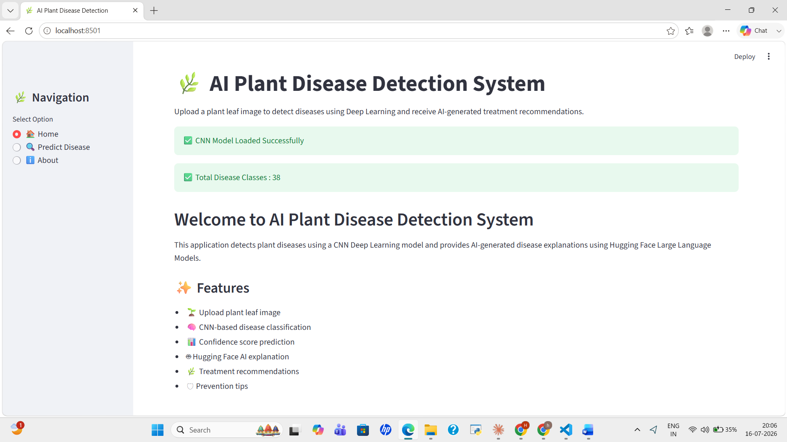

# 🌿 AI Plant Disease Detection System

An AI-powered web application for detecting plant leaf diseases using Deep Learning and providing AI-generated disease analysis and treatment recommendations. The application is built using **TensorFlow**, **Streamlit**, and the **Hugging Face Inference API**.

---

# 📌 Features

- 🌱 Detects plant leaf diseases from uploaded leaf images
- 🧠 Deep Learning-based disease classification
- ⚡ Transfer Learning using CNN, ResNet50, MobileNetV2, and EfficientNetB0
- 🤖 AI-generated disease description and treatment recommendations using Hugging Face
- 📊 Model comparison and evaluation
- 🖥️ Interactive Streamlit web application

---

# 🤖 Hugging Face Generative AI Integration

The project integrates Hugging Face Generative AI to provide detailed disease information and treatment recommendations after plant disease prediction.

The predicted disease from the deep learning model is passed to a Large Language Model (LLM), which generates:

- Disease Overview
- Symptoms
- Causes
- Recommended Treatment
- Prevention Tips

The generated response is designed to be simple and farmer-friendly.

---

## 🔑 API Configuration

The Hugging Face API key is securely loaded using environment variables.

Required package:

```bash
pip install python-dotenv huggingface_hub
```

---


# 📂 Project Structure

```text
Plant-Disease-Detection/
│
├── Screenshots/
│   ├── Home.png
│   ├── Upload Image.png
│   ├── Prediction Result.png
│   ├── AI Recommendation.png
│   ├── AI Recommendation 2.png
│   └── Model Information.png
│
├── app.py
├── class_names.pkl
├── mobilenet_final.keras
├── HuggingFace.ipynb
├── Model Evaluation.ipynb
├── Plant.ipynb
├── Plant_Disease_Transfer_Learning_MobileNet_ResNet.ipynb
├── model_comparison.csv
├── requirements.txt
├── .gitignore
├── Report.pdf
└── README.md
```

---

# 🛠️ Technologies Used

- Python
- TensorFlow / Keras
- Streamlit
- NumPy
- Pillow (PIL)
- Hugging Face Inference API
- Pickle

---

# 🧠 Deep Learning Models

| Model | Purpose |
|--------|---------|
| CNN | Baseline Model |
| ResNet50 | Transfer Learning |
| MobileNetV2 | Transfer Learning |
| EfficientNetB0 | Best Performing Model |

---

# 📈 Model Evaluation

The project compares multiple Deep Learning models based on validation accuracy and overall performance.

The detailed comparison is available in:

```
model_comparison.csv
```

---

# 🚀 Installation

Clone the repository

```bash
git clone https://github.com/harini0905/AI-Plant-Disease-Detection.git
```

Move to the project folder

```bash
cd AI-Plant-Disease-Detection
```

Install dependencies

```bash
pip install -r requirements.txt
```

Run the Streamlit application

```bash
streamlit run app.py
```

---

# 📷 Streamlit Application Screenshots

## 🏠 Home Page



---

## 📤 Upload Image


---

## 🔍 Disease Prediction Result


---

## 🤖 AI Recommendation - Disease Analysis


---

## 💊 AI Recommendation - Treatment & Prevention


---

## 📊 Model Information


---

# 📂 Dataset

The dataset used in this project is the **New Plant Diseases Dataset (Augmented)** obtained from **Kaggle**.

> Dataset Link: https://www.kaggle.com/datasets/vipoooool/new-plant-diseases-dataset

---

## 🖥️ Training Environment

The models were trained using different environments based on computational requirements.

- **CNN Baseline Model** and **EfficientNetB0 Transfer Learning Model** were trained locally using Visual Studio Code.
- **ResNet50** and **MobileNetV2 Transfer Learning Models** were trained using GPU acceleration in Google Colab to handle the higher computational requirements of deep learning training.

After training, the best-performing models were saved and integrated into the Streamlit application for real-time plant disease prediction.

---

## 📂 Model Files

Due to GitHub file size limitations, 
  1.CNN
  2.ResNet50
  3.EfficientNetB0   models are stored in Google Drive.

You can download the model files here:

🔗 [Download Models from Google Drive](https://drive.google.com/drive/folders/1zPc-vFmNNJCk-UeN3L2xAlO4ia-I5D6J?usp=sharing)

---

# 📌 Future Enhancements

- Deploy using Streamlit Cloud
- Mobile application integration
- Real-time camera-based disease detection
- Disease severity estimation
- Support for additional crop species
- Multi-language support

---

# 👩‍💻 Author

**A. Harini**

Aspiring Data Scientist


---